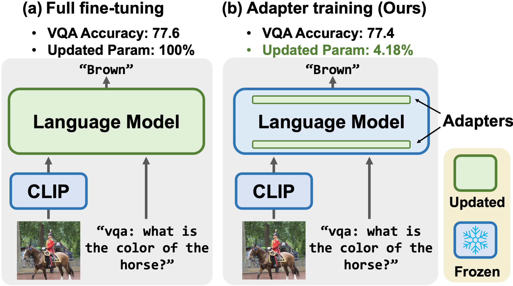

# VL-Adapter

* Authors: [Yi-Lin Sung](https://ylsung.github.io/), [Jaemin Cho](https://j-min.io/), [Mohit Bansal](https://www.cs.unc.edu/~mbansal/)
* Paper: ["VL-Adapter: Parameter-Efficient Transfer Learning for Vision-and-Language Tasks"](https://arxiv.org/abs/2112.06825) (CVPR 2022)

We evaluate VL-adapter in a unified multi-task
setup on both image-text and video-text benchmarks. For the image-text tasks, we use four diverse V&L datasets: VQAv2, GQA, NLVR2, and MSCOCO image captioning. For video-text tasks, we use TVQA, How2QA, TVC, and YC2C. 

Our results demonstrate that training the adapter with the weight-sharing technique (4.18% of total parameters for image-text tasks and 3.39% for video-text tasks) can match
the performance of fine-tuning the entire model.



** Note **
Please go into CLIP-ViL folder and follow the README there for running the experiments of adapters on CLIP-ViL. This README is for adapters on VL-Bart.


## Installation

```
# Create python environment (optional)
conda create -n vlt5 python=3.8
source activate vlt5

# Install python dependencies
pip install -r requirements.txt

# Download T5/BART backbone checkpoint
python download_backbones.py

# For MSCOCO captioning evaluation (optional; for captioning only)
python -c "import language_evaluation; language_evaluation.download('coco')"
```

## Code structure
```bash
# Store images, features, and annotations
./datasets
    COCO/
        images/
        clip_featuers/
    VG/
        images/
        clip_features/
    GQA/
        images/
        clip_features/
    nlvr/
        images/
        clip_features/
    vqa/
    lxmert/

    video/
        ann/
        vis_features

# Train VL-T5 with adapters
./VL-T5/
    src/
        modeling_t5.py modeling_bart.py                       <= VL-T5/VL-BART model classes
        pretrain.py, pretrain_data.py, pretrain_model.py      <= pretraining
        vqa.py, vqa_data.py vqa_model.py ...                  <= fine-tuning on downstream tasks (ex. VQA, GQA, NLVR2)
        multitask.py, multitask_data.py multiask_model.py     <= multitask learning on 7 downstream tasks
        param.py                                              <= (argparse) configuration
        tokenization.py                                       <= custom tokenizer
        utils.py, dist_utils.py                               <= utility functions
    snap/                                                     <= store weight checkpoints
    scripts/                                                  <= bash scripts for pretraining and finetuning
```

## Data

### Image-text dataset
Please go to [link](https://drive.google.com/file/d/1O_RU1iFh_sbItZCTkOHUrbVIQQ_89Djj/view?usp=sharing) to download the processed CLIP features. We suggest to use [gdrive](https://github.com/prasmussen/gdrive) to download it. Unzip the downloaded file and arrange the folders following the format which is shown in the "Code Structure."

If you would like to use dgrive to download the data, please try the following command

```
gdrive download 1O_RU1iFh_sbItZCTkOHUrbVIQQ_89Djj
```

### Extract your own CLIP features
Please refer to `feature_extraction` for more details.

### Video-text dataset
Please go to [VALUE](https://github.com/VALUE-Leaderboard/DataRelease) to download the ViT processed data.

## Run different approaches
The following scripts can run every approach with the best hyper-parameters.

### Image dataset

```bash
# Full fine-tuning
cd VL-T5/
bash scripts/image/full_finetuning.sh 1

# Single Adapter
cd VL-T5/
bash scripts/image/single_adapter.sh 1

# Multiple Adapters
cd VL-T5/
bash scripts/image/multiple_adapters.sh 1

# Hyperformer
cd VL-T5/
bash scripts/image/hyperformer.sh 1

# Single Compacter
cd VL-T5/
bash scripts/image/single_compacter.sh 1

# Multiple Compacters
cd VL-T5/
bash scripts/image/multiple_compacters.sh 1

# Single LoRA
cd VL-T5/
bash scripts/image/single_lora.sh 1

# Multiple LoRA
cd VL-T5/
bash scripts/image/multiple_lora.sh 1

# Single Prompt
cd VL-T5/
bash scripts/image/single_prompt.sh 1

# Multiple Prompts
cd VL-T5/
bash scripts/image/multiple_prompts.sh 1
```

### Video dataset

```bash
# Full fine-tuning
cd VL-T5/
bash scripts/video/full_finetuning.sh 1

# Single Adapter
cd VL-T5/
bash scripts/video/single_adapter.sh 1

# Single LoRA
cd VL-T5/
bash scripts/video/single_lora.sh 1

# Single Prompt
cd VL-T5/
bash scripts/video/single_prompt.sh 1

```


## Acknowledgement

This repo is adapted from [VLT5](https://github.com/j-min/VL-T5). I also borrow some codes from [CLIP](https://github.com/openai/CLIP), [CLIP-ViL](https://github.com/clip-vil/CLIP-ViL), [Compacter](https://github.com/ylsung/compacter), [Hyperformer](https://github.com/rabeehk/hyperformer) and [Prefix-tuning](https://github.com/XiangLi1999/PrefixTuning).


## Reference

Please cite our paper if you use our models in your project.

```bibtex
@inproceedings{sung2022vladapter,
  title     = {VL-Adapter: Parameter-Efficient Transfer Learning for Vision-and-Language Tasks},
  author    = {Yi-Lin Sung, Jaemin Cho, Mohit Bansal},
  booktitle = {CVPR},
  year      = {2022}
}
```